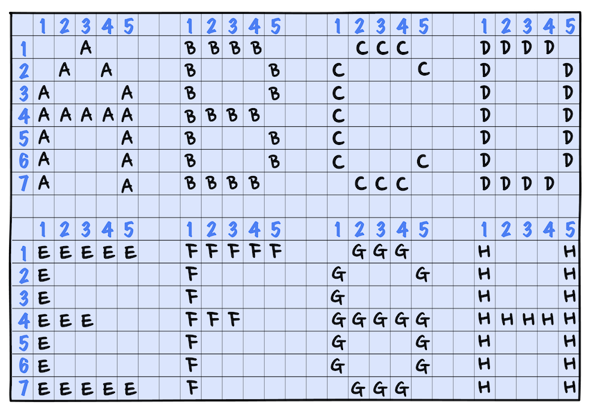

# 👨‍💻 Project: Block Letters

## 🎯 The Challenge from [Codecademy](http://www.codecademy.com/)

ASCII art is a way of creating images using the individual characters from a keyboard.

For example, below is an ASCII art of some letters from the English alphabet.



The letter F is made up of 5 characters in the first row, one character in the second and third rows, three characters in the fourth row, and one character in the fifth, sixth, and seventh row. These characters when viewed together look like the letter F.

In this project, we will write a Python program that displays the initials of your name in block characters to dip your toes into the world ASCII art.

---

## 🔍 **Code Explanation (Generate by GitHub Copilot)**

The **Python program** creates *ASCII art* by using the `print()` function to display **block letters**. Here's how it works:

### **📋 Complete Code Structure**

```python
# Creates ASCII art of letter "T"
print("""TTTTT""")  # Top horizontal line
print("""  T  """)  # Vertical stem (centered)
print("""  T  """)  # Vertical stem
print("""  T  """)  # Vertical stem
print("""  T  """)  # Vertical stem
print("""  T  """)  # Vertical stem
print("""  T  """)  # Vertical stem (bottom)
```

### **🎯 How It Works**

**1. Triple Quotes (`"""`)**
- Uses *triple-quoted strings* to create **multi-character patterns**
- No need for *escape characters* or **complex formatting**
- Each string contains the **exact characters** for one *row*

**2. Letter Formation Strategy**
- **Row 1:** `TTTTT` - Creates the *top horizontal bar* of letter **T**
- **Rows 2-7:** `  T  ` - Creates the *vertical stem* with **proper spacing**

**3. Character Positioning**
- **Two spaces** before and after the `T` ensure *perfect centering*
- **T characters** form the *visible structure* of the letter
- **Consistent width** maintains proper *alignment*

**4. Visual Output**
```
TTTTT
  T  
  T  
  T  
  T  
  T  
  T  
```

### **💡 Key Programming Concepts**

- **`Print Function`** - Displaying *sequential output* to the **console**
- **`String Literals`** - Using *triple quotes* for **multi-character strings**
- **`Pattern Recognition`** - Understanding how *characters* form **visual shapes**
- **`ASCII Art Fundamentals`** - Creating *images* using **text characters**
- **`Spacing & Alignment`** - Using *spaces* for **proper positioning**
- **`Sequential Execution`** - Each `print()` runs *one after another*

### **🎨 Design Process**

1. **Plan the Letter** → Sketch the *letter shape* on **7 rows**
2. **Character Mapping** → Decide which *characters* represent **visible parts**
3. **Spacing Calculation** → Add *spaces* for **proper alignment**
4. **Code Implementation** → Use `print()` statements for *each row*
5. **Visual Testing** → Run and *adjust* as **needed**

### **🔧 Technical Details**

- **7 rows total** - Standard height for *block letters*
- **5 characters wide** - Consistent *width* for proper **formatting**
- **Triple quotes** - Simplifies *string creation* without **escape characters**
- **Console output** - Direct *display* to the **terminal/screen**

This simple approach demonstrates how **fundamental programming concepts** can create *visual art* using just **text characters** and basic **print statements**.

---

### 🙏 **Thank You [Codecademy](https://www.codecademy.com/)**

I want to express my **sincere gratitude** to [**Codecademy**](https://www.codecademy.com/) for their **excellent learning platform**, **quality courses**, and the *opportunity to enhance my coding skills*. The **knowledge and experience** gained from [Codecademy](https://www.codecademy.com/) have **significantly contributed** to creating these projects and **developing my abilities**.