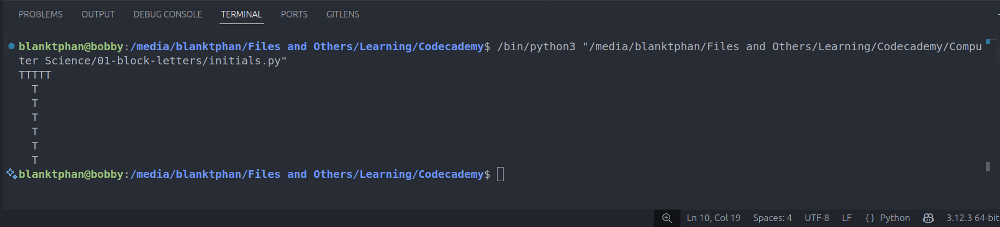

# Project: Block Letters

## The Challenge

ASCII art is a way of creating images using the individual characters from a keyboard.

For example, below is an ASCII art of some letters from the English alphabet.

The letter F is made up of 5 characters in the first row, one character in the second and third rows, three characters in the fourth row, and one character in the fifth, sixth, and seventh row. These characters when viewed together look like the letter F.

In this project, we will write a Python program that displays the initials of your name in block characters to dip your toes into the world ASCII art.

---

### 🙏 Thank You [CODECADEMY](http://www.codecademy.com/)

I want to express my sincere gratitude to [**Codecademy**](http://www.codecademy.com/) for their *excellent learning platform*, *quality courses*, and the opportunity to enhance my coding skills. The knowledge and experience gained from [**Codecademy**](http://www.codecademy.com/) have significantly contributed to creating these projects and developing my abilities.