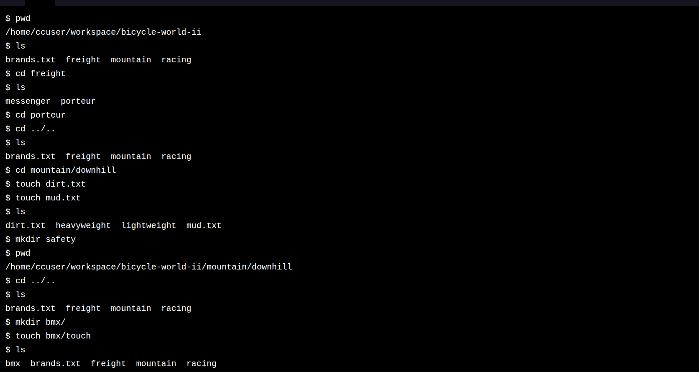

# Project: Bicycle World



## The Challenge

Welcome to Bicycle World, the premier text-based bicycle shop! This shop is only accessible to programmers like you, who are familiar with the command line.

In this project, you’ll use the commands you learned to navigate and edit the filesystem of this special shop.

The starting filesystem is shown below. (Bicycle World recently changed owners, who named the main directory bicycle-world-ii.)

```
bicycle-world-ii
|—— brands.txt
|—— freight/
|   |—— messenger/
|   |—— porteur/
|—— mountain/
|   |—— downhill/
|   |   |—— heavyweight/
|   |   |—— lightweight/
|   |—— hardtail/
|—— racing/
    |—— road/
    |—— track/

```

If you get stuck during this project or would like to see an experienced developer work through it, click “Get Unstuck“ to see a project walkthrough video.

---

### 🙏 Thank You [CODECADEMY](http://www.codecademy.com/)!!!

I want to express my sincere gratitude to [**Codecademy**](http://www.codecademy.com/) for their *excellent learning platform*, *quality courses*, and the opportunity to enhance my coding skills. The knowledge and experience gained from [**Codecademy**](http://www.codecademy.com/) have significantly contributed to creating these projects and developing my abilities.