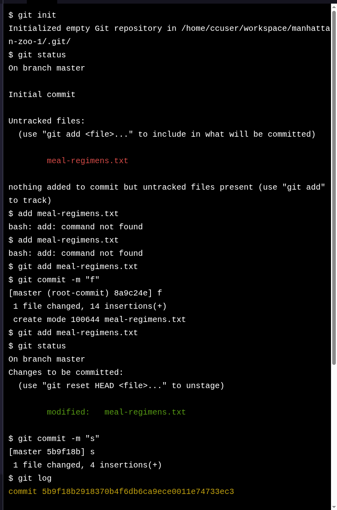

# Project: Manhattan Zoo

## The Challenge

Ready to try out some of your new Git knowledge?

In this project, you’ll use Git to keep track of meal guidelines for animals at the Manhattan Zoo.

If you get stuck during this project or would like to see an experienced developer work through it, click “Get Unstuck“ to see a project walkthrough video.

---

### 🙏 Thank You [CODECADEMY](http://www.codecademy.com/)!!!

I want to express my sincere gratitude to [**Codecademy**](http://www.codecademy.com/) for their *excellent learning platform*, *quality courses*, and the opportunity to enhance my coding skills. The knowledge and experience gained from [**Codecademy**](http://www.codecademy.com/) have significantly contributed to creating these projects and developing my abilities.