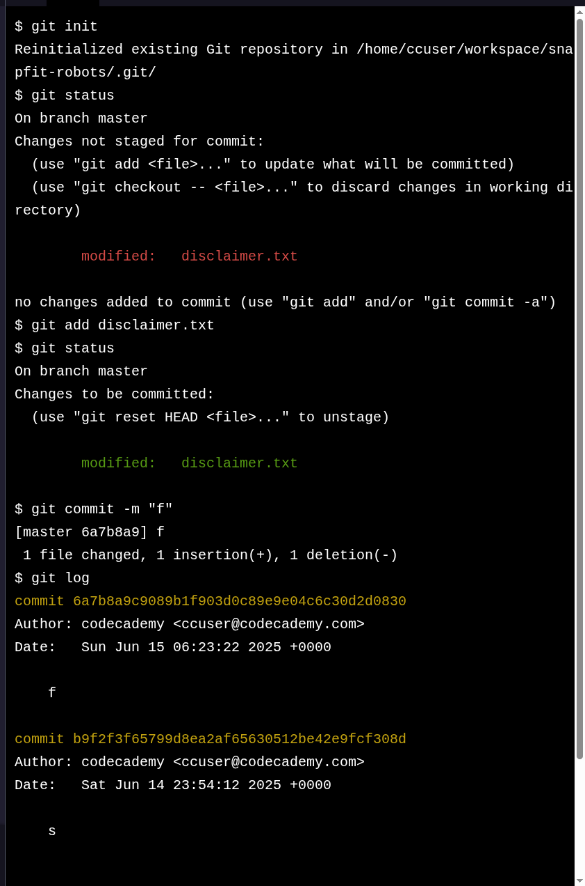

# Project: SnapFit Robots, Inc.

## The Challenge

Now that you’ve had more practice with the Git workflow, let’s solidify your new skills even more.

In this project, you will be working on assembly instructions for Snap-Fit Robots Inc., a build-it-yourself robot company.

If you get stuck during this project or would like to see an experienced developer work through it, click “Get Unstuck“ to see a project walkthrough video.

---

### 🙏 Thank You [CODECADEMY](http://www.codecademy.com/)!!!

I want to express my sincere gratitude to [**Codecademy**](http://www.codecademy.com/) for their *excellent learning platform*, *quality courses*, and the opportunity to enhance my coding skills. The knowledge and experience gained from [**Codecademy**](http://www.codecademy.com/) have significantly contributed to creating these projects and developing my abilities.