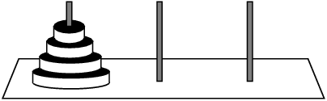

# 📋 Project: Towers-of-hanoi

## 🎯 The Challenge from [Codecademy](http://www.codecademy.com/)

The Towers of Hanoi is a classic mathematical puzzle involving three rods and a set of disks of different sizes. At the start, all disks are stacked on the **leftmost rod** in descending order, forming a conical shape with the largest disk at the bottom.



Move the entire stack to the **rightmost rod**, following these rules:

1. 🟢 **One disk at a time:** Only one disk can be moved per turn.
2. 🟡 **Top disk only:** Each move consists of taking the top disk from one rod and placing it on top of another rod or onto an empty rod.
3. 🔴 **No larger on smaller:** No disk may be placed on top of a smaller disk.

---

### 🛠️ What You'll Do

In this project, you'll use your knowledge of **stacks** to build an interactive solution for the Towers of Hanoi puzzle in Python.

Ready to solve the puzzle? Let's get started!

---

## 🔍 Code Explanation (Generated by AI)

### 📋 Complete Project File Structure

```plaintext
.
├── script.py   # Main file to run the Towers of Hanoi game using the Stack class
├── stack.py    # Defines the Stack class for stack data structure operations
└── node.py     # Defines the Node class used within the Stack
```

### ⚙️ How the Program Works

1. **Stack Initialization**
    ```python
    # In script.py
    left_stack = Stack("Left")
    middle_stack = Stack("Middle")
    right_stack = Stack("Right")
    ```
    - Three Stack objects are created to represent the rods: Left, Middle, and Right.

2. **Disk Setup**
    ```python
    num_disks = int(input("Enter number of disks (minimum 3): "))
    for disk in range(num_disks, 0, -1):
         left_stack.push(disk)
    ```
    - User is prompted for the number of disks (minimum 3).
    - All disks are placed on the Left rod, largest at the bottom.

3. **Minimum Moves Calculation**
    ```python
    min_moves = 2 ** num_disks - 1
    print(f"Minimum moves: {min_moves}")
    ```
    - The optimal number of moves is calculated using the formula 2ⁿ - 1.

4. **User Interaction and Move Validation**
    ```python
    # Pseudocode
    while not right_stack.is_full():
         print_stacks()
         from_stack = get_user_stack("move from")
         to_stack = get_user_stack("move to")
         if valid_move(from_stack, to_stack):
              disk = from_stack.pop()
              to_stack.push(disk)
              move_count += 1
         else:
              print("Invalid move. Try again.")
    ```
    - The user selects source and destination rods for each move.
    - The program checks that no larger disk is placed on a smaller one.

5. **Game Status and Completion**
    ```python
    print(f"Game completed in {move_count} moves. Optimal: {min_moves}")
    ```
    - The current state of each rod and move count are displayed.
    - When all disks are on the Right rod, the game ends and results are shown.

### 🔗 File Relationships

- `script.py` imports the `Stack` class from `stack.py` to manage rods.
- `stack.py` imports the `Node` class from `node.py` to implement the stack as a linked list.

### 💡 Key Programming Concepts

- **Stacks**: Used to simulate rods and disk movement.
- **Encapsulation**: Each rod is an instance of the Stack class.
- **Validation**: Enforces Towers of Hanoi rules for legal moves.
- **Modularity**: Code is organized into separate files for maintainability.

### 🧩 Example Program Flow

1. User starts the game and enters the number of disks.
2. All disks are stacked on the Left rod.
3. User moves disks between rods, following the rules.
4. The process repeats until all disks are on the Right rod.
5. The program displays the user's move count and compares it to the optimal solution.

### 📊 Example Output

```terminal
Enter number of disks (minimum 3): 3
Minimum moves: 7

Left Stack: [3, 2, 1]
Middle Stack: []
Right Stack: []

Move disk from Left to Right
...

Game completed in 9 moves. Optimal: 7
```

This project demonstrates how stacks and modular code design can be used to solve the Towers of Hanoi puzzle interactively in Python.

---

### 🙏 Thank You [Codecademy](https://www.codecademy.com/)

I want to express my sincere gratitude to [Codecademy](https://www.codecademy.com/) for their excellent learning platform, quality courses, and the opportunity to enhance my coding skills. The knowledge and experience gained from [Codecademy](https://www.codecademy.com/) have significantly contributed to creating these projects and developing my abilities.