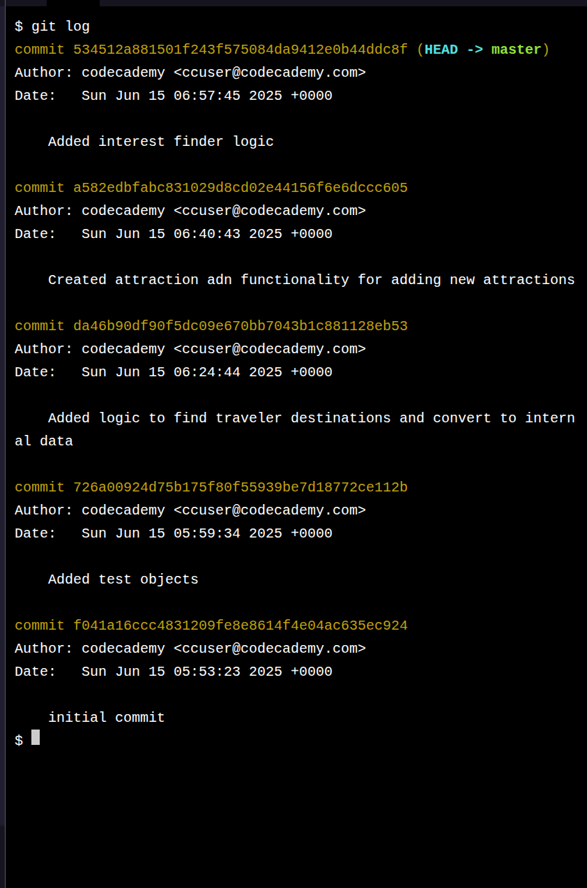

# Project The Boredless Tourist

## The Challenge

Welcome to The Boredless Tourist, an online application giving you the power to find the parts of the city that fit the pace of your life. We at The Boredless Tourist run a recommendation engine using Python. We first evaluate what a person’s interests are and then give them recommendations in their area to venues, restaurants, and historical destinations that we think they’ll be engaged by. Let’s get started!

If you get stuck during this project or would like to see an experienced developer work through it, click “Get Unstuck“ to see a project walkthrough video.